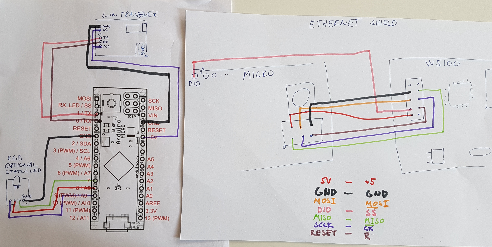
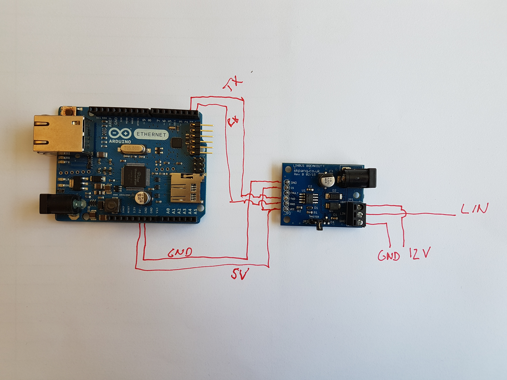

**For esp32 go to [esp32](https://github.com/beamylabs/signalbroker-lin-transceiver/tree/esp32) branch**

**For updates on arduino micro pcb go to [arduino_micro_pcb](https://github.com/beamylabs/signalbroker-lin-transceiver/tree/arduino_micro_pcb) branch**

# Lin bus reader and writer

Ardunio Ethernet (alt. arduino micro + ethernet shield) + MCP2004A. Read/write, act as a master or one or many slaves.

## Setup

### Arduino Micro based


for ENC28J60 connect (Same coloring as in picture)

| micro |  W5100/ENC28J60 |
|-----|-----|
| 5v | VCC |
| GND | GND |
| MOSI | SI |
| D10 | CS |
| MISO | S0 |
| SCLK | SCK |
| RESET | RST |

### Arduino Ethernet based


components:

* Arduino micro
https://store.arduino.cc/arduino-micro

* Lin transiver (MCP2004A based)
http://skpang.co.uk/catalog/linbus-breakout-board-p-1417.html

* Ethernet wiznet w5100
http://pchbutik.se/nytt-pa-lager/743-w5100-ethernet-module-ethernet-network-module-for-arduino.html?search_query=w510&results=1
[image](doc/W5100-LAN-Arduino.jpg)

Alternative hardware...

* ENC28J60 ethernet module - NOT recommended, drops lots of udp packets!
https://www.ebay.com/itm/1-Ethernet-Module-ENC28J60-MINI-Ethernet-Network-Module-Arduino-Raspberry-pi-/181357105178
<br/>
<br/>
for this you need to use the following library
https://github.com/UIPEthernet/UIPEthernet
<br/>
<br/>

* Ardunio ethernet - less soldering!
https://store.arduino.cc/arduino-ethernet-rev3-without-poe

* to be able to program the arduino/only needed for Arduino Ethernet
https://store.arduino.cc/arduino-usb-2-serial-micro

Yet other alternatives...
* Arduino uno
https://store.arduino.cc/arduino-uno-rev3
* Ardunio ethernet shield
https://store.arduino.cc/arduino-ethernet-rev3-without-poe

Yet another alternative, probably the leanest Configuration (untested)
* Arduino Leonard ethernet
https://www.electrokit.com/produkt/arduino-leonardo-ethernet-med-poe/

## Configuration

### Arduino

#### Install software

* Install arduino IDE https://www.arduino.cc/en/Main/Software

* Clone the repository and copy lin.cpp and lin.h https://github.com/AleksandarFilipov/LIN to you arduino library (pick your library folder name) folder. (Inspration: ~/arduino/arduino-1.8.5/libraries/[your libaray])

* Open the linbus/linbus.ino file in arduino ide. Select propriate port from the tools menu and the upload the software.

### Adafruit Feather 32u4

If you are using an **Adafruit Feather 32u4** you need to add Adafruit board definitions to the Arduino IDE.

`File/Preferences`:
`Additional Boards Manager URLs: https://adafruit.github.io/arduino-board-index/package_adafruit_index.json`

`Tools/Board:/Boads Manager...`
Install "`Adafruit AVR boards`"

Now "`Adafruit Feather 32u4`" should be selectable under `Tools/Board:`

### Upload software to arduino

Once it's configured use Arduino Studio to upload your software. When uploading the software make sure RX is discsonnect, othervise the upload will likely fail.

### Signal Server

Signal sever will configure the node automatically.

https://github.com/volvo-cars/signalbroker-server

Make sure to ports are open on the linux machine hosting the signalserver.

For ubuntu 16.04 you would need to open some port...

```bash
sudo ufw allow 2013
sudo ufw allow 2014
sudo ufw allow 4000
```

And configure your interfaces.json accordingly

```json
{
      "namespace": "LinSlave",
      "type": "lin",
      "config": {
        "device_identifier": 1,
        "server_port": 2014,
        "target_host": null,
        "target_port": 2013
      },
      "device_name": "lin",
      "node_mode": "slave",
      "ldf_file": "configuration/ldf_files/linone.ldf",
      "schedule_file": "configuration/ldf_files/linone.ldf",
      "schedule_table_name": "linoneSchedule",
      "schedule_autostart": false
    },s
```

In the example above the arduino is set up as a slave. by setting:

```json
{
    "node_mode": "master",
}
```
arduino will act as a master. In this case it also make sense to activate the automatic schedule

```json
{
    "node_mode": "master",
    "schedule_autostart": true,
}
```

## Starting
Once the arduino is powered on it will start by fetching configuration from the signal server.
Once the onboard led goes on, the board has fetched its configuration successfully from the signal server. (It will keep trying feting configuration until it succeeds)

To reload the configuration press the reset button on the top left (see picture above)

## Debugging
The arduino will by default output it's logs on port 3000, again, make sure to unblock that port in you firewall (check top of ino file to switch port).

Logging can the be traced on ubunto 16.04 by issuing

```bash
sudo tcpdump udp port 3000 -vv -X
```

## Nice to know
In slave mode the arduino keeps a write buffer which it writes every time the master scheduler queries it. This buffer is never cleared (the same reasoning goes for the signal server), so in practice, if you tampered with the wrong signal you should restart the signal server which will reset the arduino.

## References

* [MCP2004A documentation](http://ww1.microchip.com/downloads/en/DeviceDoc/20002230G.pdf)
