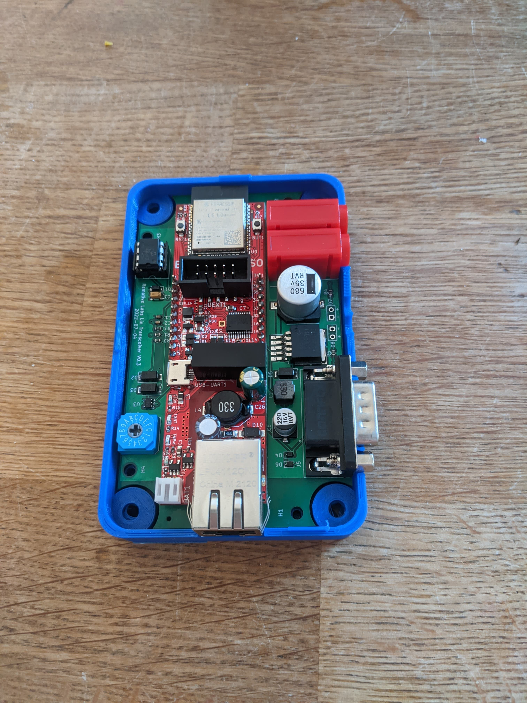
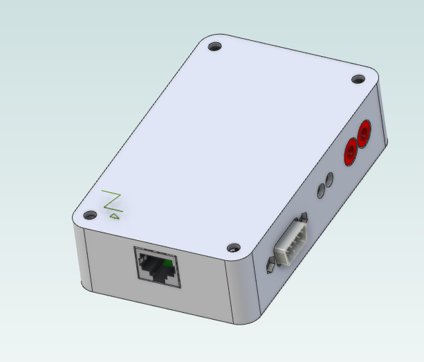

# LIN





More images here: [link](doc/Pictures/)

## Installation 

### Prerequisites


Download USB drivers for the ESP device, choose driver depending on OS here:
https://www.olimex.com/Products/IoT/ESP32/ESP32-POE/open-source-hardware 

To be able to upload this project to your device you need PlatformIO. 
You can either install it as a [CLI application](https://docs.platformio.org/en/latest/core/index.html#) but the preferred way is to use their extension within an [IDE](https://docs.platformio.org/en/latest/integration/ide/pioide.html#).

I guess that the most popular is to use VS Code so I will use it in the example below.

#### VS Code

* [VS Code](https://code.visualstudio.com/)
* [PlatformIO Extension](https://marketplace.visualstudio.com/items?itemName=platformio.platformio-ide)

If you have installed the applications above, open this folder with VS Code.  

## Configuration

Configure the main.cpp file before uploading to the ESP32. 
### RibID - device identifier

The `rotary switch` is used to specify device identifier within the range 0..15. If you need need an id outside of the range you need to modify the source code.

>Alternatively you can hardcode, There is a `define` in the main.cpp file that holds the rib_id value for the ESP32. 

>If you have multiple ESP32 that should be connected to the same Beamy Broker, every ESP32 must have a unique rib_id.

### Master/Slave

`Master/Slave` is automatically set according to the proviced setting in `interfaces.json`

>On older PCB you need to set a jumper manually.

### DHCP

If you are intended to use DHCP the ethClient connect function should look like this
```cpp
ethClient.connect(config);
```

But if you are intended to use static IP, then the connect function should look like this instead
```cpp
ethClient.connect(config, false, IPAddress(192, 168, 1, 20), IPAddress(192, 168, 1, 10), IPAddress(255, 255, 255, 0));
```

So what does this mean? 

The false flag indicates that DHCP is disabled. 

The first IPAddress is the ESP32 address.

The second IPAdress is the host address (where the beamy broker is running)

The third IPAdress is a subnet address.

Now you are ready to upload this to your device!!

### Modify the interface.json on the server-side

When you have uploaded the firmware to your ESP32-devices and assigned them with unique rib IDs. You need to configure the interfaces.json file on the beamy broker-server side in the following way:

* namespace - Unique namespace name (you will access all necessary data from gRPC API with namespace name)
* device_identifier - rib ID that you assigned to the device
* target_host - null if using dhcp, otherwise type in IP address of esp32.
* server/target port - needs to be a unique port for each device
* node_mode: master/slave depending on how the device is connected to the LIN bus
* ldf_file - paste the link to where you have the LDF file
* schedule_file - same as ldf_file (like 99% of the times)
* schedule_table_name - type in which scheduler you want to use when you are running the device as the master
* schedule_autostart - if you are running as master and you want the provided schedule_table to autostart, this value should be true otherwise false

## Slave
If you are intended to run as a slave, your interface file should look like this (but with your settings and .ldf files). 

#### **Remember to set the right rib_id**

### DHCP

```json 
{
      "namespace": "lin_slave",
      "type": "lin",
      "config": {
        "device_identifier": 1,
        "server_port": 2014,
        "target_port": 2013
      },
      "node_mode": "slave",
      "ldf_file": "configuration/ldf_files/linone.ldf",
}
```

### Static IP

```json 
{
      "namespace": "lin_slave",
      "type": "lin",
      "config": {
        "device_identifier": 1,
        "server_port": 2014,
        "target_host": "192.168.0.20",
        "target_port": 2013
      },
      "node_mode": "slave",
      "ldf_file": "configuration/ldf_files/linone.ldf",
}
```

## Master

If you are intended to run as a master, your interface file should look like this.

### DHCP

```json 
{
      "namespace": "lin_master",
      "type": "lin",
      "config": {
        "device_identifier": 1,
        "server_port": 2014,
        "target_port": 2013
      },
      "node_mode": "master",
      "ldf_file": "configuration/ldf_files/linone.ldf",
      "schedule_file": "configuration/ldf_files/linone.ldf",
      "schedule_table_name": "linoneSchedule",
      "schedule_autostart": true
}
```

### Static IP

```json 
{
      "namespace": "lin_master",
      "type": "lin",
      "config": {
        "device_identifier": 1,
        "server_port": 2014,
        "target_host": "192.168.1.20",
        "target_port": 2013
      },
      "node_mode": "master",
      "ldf_file": "configuration/ldf_files/linone.ldf",
      "schedule_file": "configuration/ldf_files/linone.ldf",
      "schedule_table_name": "linoneSchedule",
      "schedule_autostart": true
}
```

### Debug

Logging is by default output to serial 
```
constexpr bool LOG_TO_SERIAL = true;
```
To print logs in beamy broker debug window
```
constexpr bool LOG_TO_SERIAL = false;
```

### PCB and 3D printable boxes

All ordering information of the RemotiveLIN V1.1 box along with a BOM can be found [here](/doc/Ordering%20Information)

The Box casing can be 3D printed from the [STL files](/doc/Ordering%20Information/STL%20Casing)

The PCB can be manufactured and most parts can be assempled on the PCB by www.jlcpcb.com by uploading the [gerber, BOM and pick and place files](/doc/Ordering%20Information/PCB%20V1.1%20JLCPCB%20Ordering). The parts that are not in stock at JLCPCB needs to be ordered from a seperate supplier and then handsoldered to the PCB. These part can be found in the [BOM Excel file](/doc/Ordering%20Information/Full%20BOM%20V1.1.xlsx).

>Intention is that the software supports older revision of the PCB, if that's not the case please let us know.